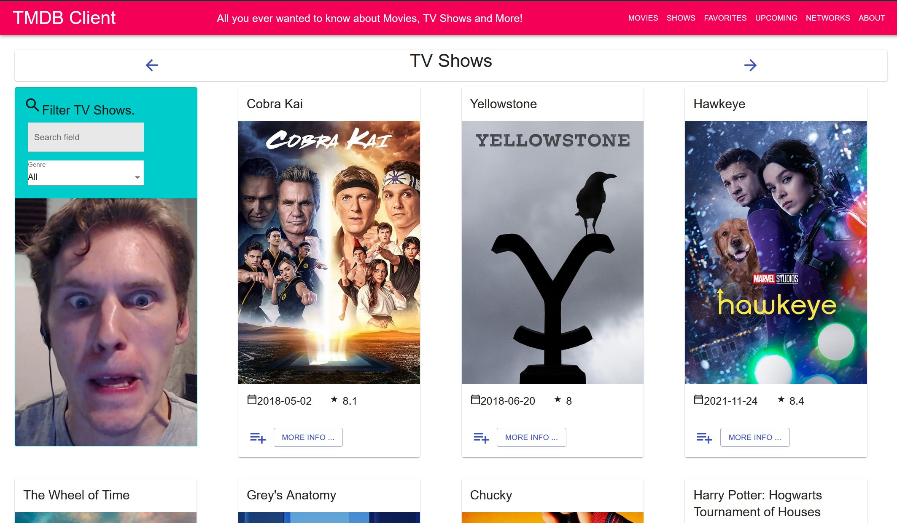
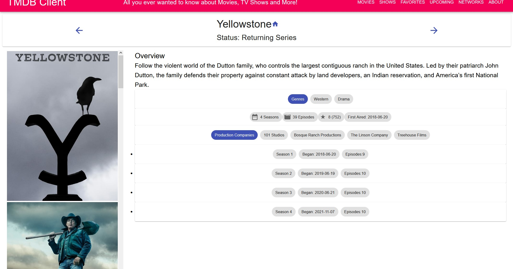
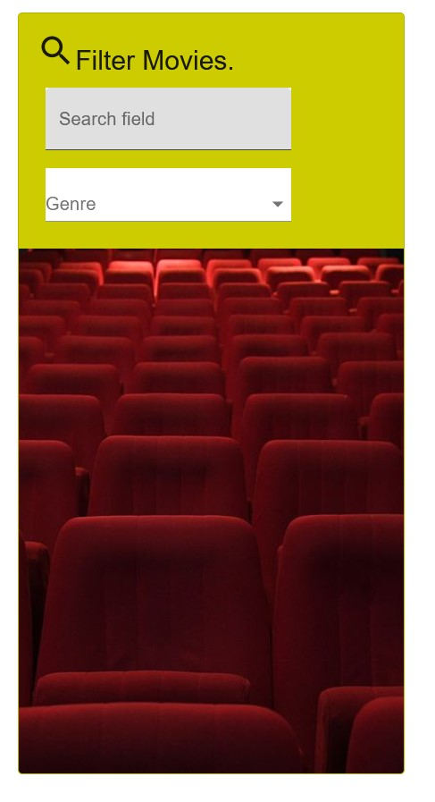
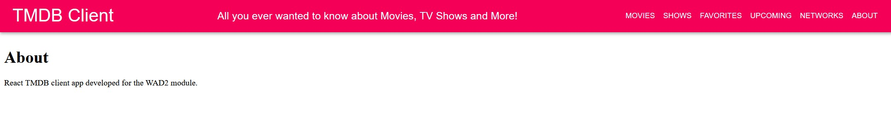

# Assignment 1 - ReactJS app.

Name: Jack Fitzpatrick

## Overview.

[A brief statement on the content of this repository.]

### Features.
 
+ Implemented TV Shows and routing from TMDB.
+ Implemented Playlist system for Shows instead of Favourites.
+ Implemented simple About Page (Could be filled with more data later on).

## Setup requirements.

Simply clone the repo and run the app, its that simple!

## API endpoints.

+ Discover list of movies - discover/movie
+ Upcoming list of movies - movie/upcoming
+ Movie details - movie/:id
+ Movie genres - /genre/movies/list
+ Discover list of TV Shows - discover/tv
+ Movie Images - movie/:id/images
+ Show Images - tv/:id/images
+ Show details - tv/:id

## App Design.

### UI Design.

Below are some screenshots of the new pages and modifications made:

>This page is a discovery page containing TV shows and series instead of Movies. It was pulled from TMDB in a similar fashion to the movies page and now has its own section and menu option! (As well as a recolour of the search bar to emphasise the different section and a lovely new image, which I was meant to change to something else but I forgot)

>A detailed view of a single show. We can see release info as well as a list of seasons and some information on each one!

>I also updated the image on the movies portion (This time its actually a fitting image and not a joke)

>A very simple about page for the site. I felt like it was a nice touch!

### Routing.

+ /shows - Discovery list of TV shows.
+ /shows/:id - Info on a particaulr show.
+ /about - An about page for the site.
+ /networks - A page to display TV networks (Not functional)

